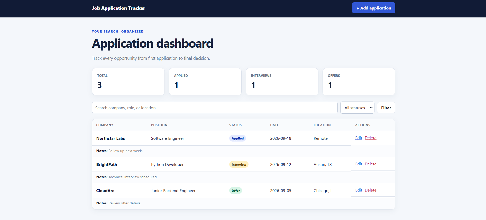
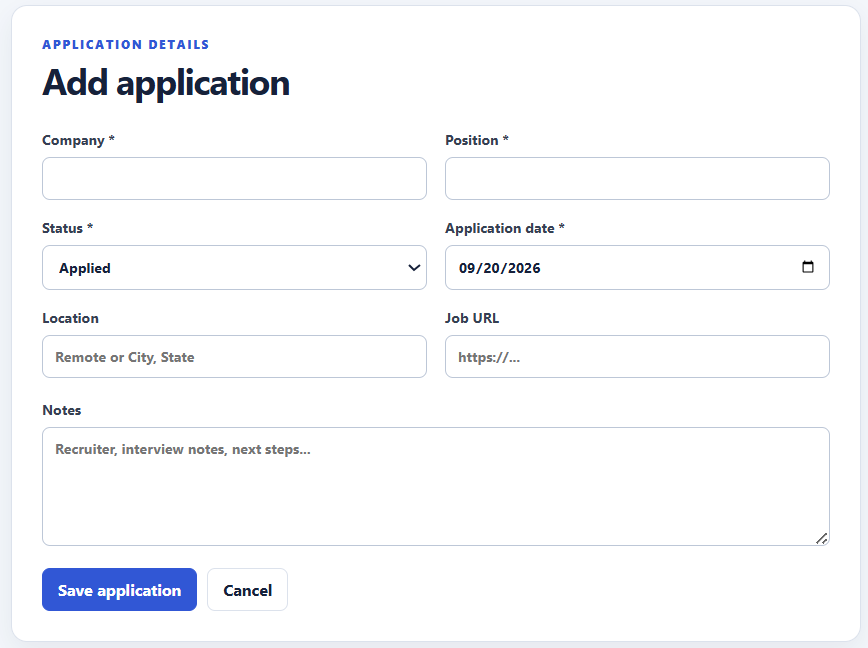

# Job Application Tracker

A lightweight web application for organizing a job search. Track applications, update their progress, search by company or role, and view a quick status dashboard.

## Screenshots

### Dashboard



### Add application



## Features

- Add, edit, and delete job applications
- Track Applied, Interview, Offer, Rejected, and Withdrawn statuses
- Search by company, position, or location
- Filter applications by status
- Dashboard totals for important stages
- Persistent SQLite storage
- Responsive interface for desktop and mobile
- Server-side form validation
- Automated tests for the main workflows

## Technology

- Python 3
- Flask
- SQLite
- HTML and CSS
- Pytest

## Run locally

1. Clone the repository and enter the project directory:

   ```bash
   git clone https://github.com/abhi89532/job-application-tracker.git
   cd job-application-tracker
   ```

2. Create and activate a virtual environment:

   ```bash
   python -m venv .venv
   ```

   Windows PowerShell:

   ```powershell
   .venv\Scripts\Activate.ps1
   ```

   macOS or Linux:

   ```bash
   source .venv/bin/activate
   ```

3. Install the dependencies:

   ```bash
   pip install -r requirements.txt
   ```

4. Start the application:

   ```bash
   flask --app app run --debug
   ```

5. Open `http://127.0.0.1:5000` in a browser.

The SQLite database is created automatically the first time the app starts.

## Optional sample data

Run the following once before starting the server:

```bash
python seed.py
```

## Run the tests

```bash
pytest -q
```

## Project structure

```text
job-application-tracker/
├── app.py
├── seed.py
├── requirements.txt
├── static/
│   └── style.css
├── templates/
│   ├── base.html
│   ├── form.html
│   └── index.html
└── tests/
    └── test_app.py
```

## Possible improvements

- Add user accounts and authentication
- Export applications to CSV
- Add interview reminders
- Deploy the application online

## License

This project is available under the MIT License.
